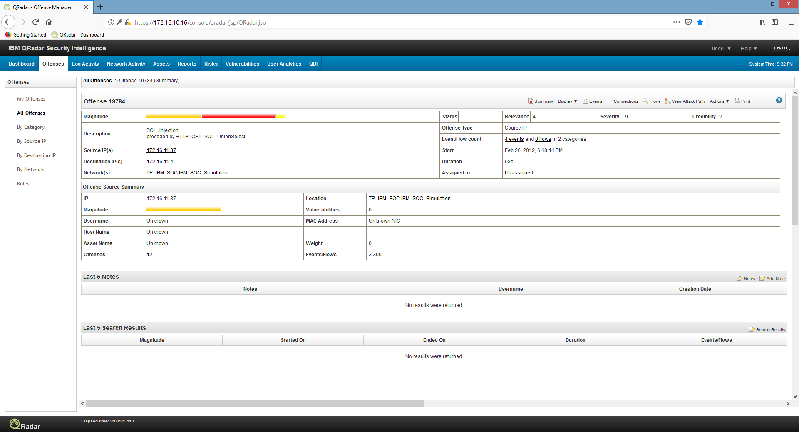
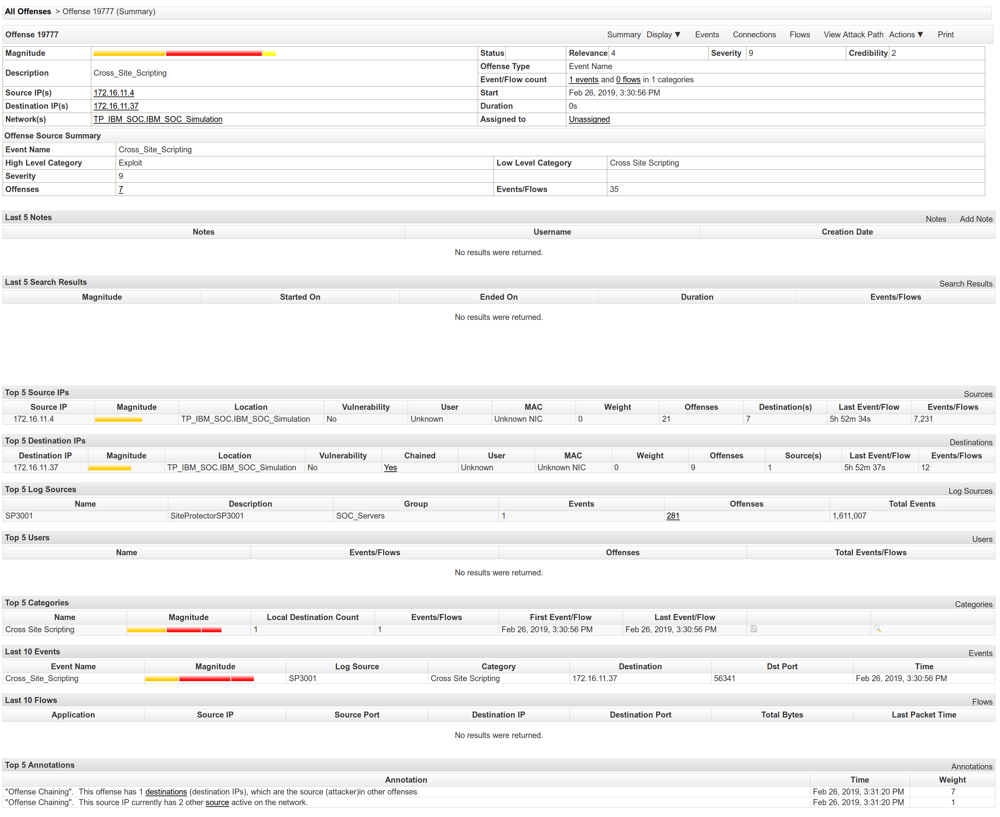

=====================================
Security Incident Response Management
=====================================

.. contents::

.. sectnum::

.. raw:: pdf

   PageBreak

Security Incident Report (Level/Tier 1)
=======================================

SQL Injection
-------------

Incident Description
~~~~~~~~~~~~~~~~~~~~
:Incident: Offense 19784 : HTTP_POST_SCRIPT     

:Duration: From Feb 26, 2019, 6:48:14 PM to 6:49:12 PM 

:Source IP(s): 172.16.11.37 

:Source Port(s): 53758, 51392 

:Target IP(s): 172.16.11.4 

:Target Port(s): 80 

:Occurrences: 4 Events 0 Flows 

:Severity: 9 

:Event Classification: SQL injection preceded by HTTP_GET_SQL_Unionselect  

Threat Analysis
~~~~~~~~~~~~~~~
Examining the event logs indicated that a user was attempting to perform SQL injection to query for unauthorised information from Feb 26, 2019, 6:48:14 PM to 6:49:12 PM, with the source IP "172.16.11.37" which indicated that the offense was conducted within the network of the Temasek Polytechnic (TP). This traffic was intercepted by Bluecoat Server which had dropped the potentially malicious SQL request issued from this user. 

Typically commands such as HTTP_GET_SQL_Unionselect does not necessarily indicate an attack, however it was followed by SQL injection at the login page, hence the severity of the offense was given a rating of 9.

Recommendation
~~~~~~~~~~~~~~
Current investigation indicates that the source IP is located in TP IBM-QRADAR lab.  This incident is escalated to TP IBM QRadar lab to identify the actual user ID by the lab server logs and to cross check with the lab’s physical sign-in entries. Given that the severity of the issue is HIGH (9), it is recommended that the raw traffic packets containing exact SQL commands issued by this user are to be fetched from IBM X-force database to be passed to the Tier2 - Triage team for further analysis.

.. raw:: pdf

   PageBreak

Supporting Data 
~~~~~~~~~~~~~~~

  Screen capture of Offense 19784: SQL Injection.

.. raw:: pdf

   PageBreak

Cross-Site Scripting
--------------------

Incident Description
~~~~~~~~~~~~~~~~~~~~
:Incident: Offense 19777 : Cross_Site_Scripting

:Duration: 0s at Feb 26, 2019, 3:30:56 PM

:Source IP(s): 172.16.11.4

:Source Port(s): 80

:Target IP(s): 172.16.11.37

:Target Port(s): 56341

:Occurrences: 1 Events 0 Flows

:Severity: 9

:Event Classification: Exploit; Cross_Site_Scripting

Threat Analysis
~~~~~~~~~~~~~~~
A cross-site scripting incident was detected at Feb 26, 2019, 3:30:56 PM, originating from the source IP of “172.16.11.4”. The destination IP of the event was “172.16.11.37”, indicating that both the attacker and victim were located within the network for TP_IBM_SOC. The offence was logged by SiteProtectorSP3001 in the SOC_Servers. The destination IP was also involved in other offenses which may indicate that the attacker may be carrying out a combination of attacks on the network. Additional investigation is required to confirm the identity of the user involved and to check the data flows between the source and destination IPs.

Recommendation
~~~~~~~~~~~~~~
This incident is to be escalated to the technical staff in the TP_IBM_SOC simulation lab for further investigation in order to determine the user IDs involved in the cross-site scripting attack, as well as the contents of the data transmitted in the attack. The login credentials and any active sessions of the victim should be reset in case the suspect user has obtained access to that information. Appropriate actions may have to be taken against the suspect user for potentially violating the TP Acceptable User Policy (AUP). 

.. raw:: pdf

   PageBreak

Supporting Data
~~~~~~~~~~~~~~~

  Screen capture of Offense 19777: Cross-Site Scripting.

.. raw:: pdf

   PageBreak

Security Intelligence Report
============================

CVE-2019-1987
-------------
:**Topic**:
   **Descriptions/Actions**

:Advisory Title:
   CVE-2019-1987

:Threat Name:
   Android Operating System - Remote code execution in privileged process from file

:Overview:
   Android Framework parsing error when handling PNG file. In the function onSetSampleX of SkSwizzler.cpp which is part of Android Framework, during the parsing of is a possible out of bounds write due to a missing bounds check . This could lead to remote code execution with no additional execution privileges needed. User interaction is needed for exploitation.

:Affected Versions:
   - Android-7.0
   - Android-7.1.1
   - Android-7.1.2
   - Android-8.0
   - Android-8.1
   - Android-9

:Affected Assets (Locations):
   Devices running Android OS worldwide

:Threat Type:
   The vulnerability could allow an attacker to send a specially crafted PNG file via messaging apps, email or webpage. If the user opens this file for viewing, remote arbitrary code execution in privileged process can be achieved, resulting in device hijack and compromise.

:Threat CVE Links:
   - https://nvd.nist.gov/vuln/detail/CVE-2019-1987
   - http://cve.mitre.org/cgi-bin/cvename.cgi?name=CVE-2019-1987
   - https://source.android.com/security/bulletin/2019-02-01

:Threat State:
   Unknown (No exploits have been spotted in the wild.)

:Threat Impact:
   High

:Recommendations:
   All Android devices should be updated with the latest security patch levels 2019-02-01 & 2019-02-05 ASAP, to fix the issues contained in this advisory. As Android is a multiple platform open source OS, an available update for your device may depend on a release from your specific manufacturer.

.. raw:: pdf

   PageBreak

CVE-2019-1663
-------------
:**Topic**:
   **Descriptions/Actions**

:Advisory Title:
   CVE-2019-1663

:Threat Name:
   Cisco RV110W, RV130W, and RV215W Routers Management Interface Remote Command Execution Vulnerability

:Overview:
   A vulnerability in the web-based management interface of the Cisco RV110W Wireless-N VPN Firewall, Cisco RV130W Wireless-N Multifunction VPN Router, and Cisco RV215W Wireless-N VPN Router could allow an unauthenticated, remote attacker to execute arbitrary code on an affected device.

:Affected Versions:
   - RV110W Wireless-N VPN Firewall versions prior: 1.2.2.1
   - RV130W Wireless-N Multifunction VPN Router version prior: 1.0.3.45
   - RV215W Wireless-N VPN Router versions prior: 1.3.1.1

:Affected Assets (Locations):
   Customers using RV110W, RV130W and RV215W worldwide

:Threat Type:
   An attacker could exploit this vulnerability by sending malicious HTTP requests to a targeted device. A successful exploit could allow the attacker to execute arbitrary code on the underlying operating system of the affected device as a high-privilege user. 

:Threat CVE Links:
   - https://nvd.nist.gov/vuln/detail/CVE-2019-1663 
   - https://cve.mitre.org/cgi-bin/cvename.cgi?name=CVE-2019-1663
   - https://tools.cisco.com/security/center/content/CiscoSecurityAdvisory/cisco-sa-20190227-rmi-cmd-ex 

:Threat State:
   Certain (Detected port scanning activities by hackers for affected devices as of 1st March 2019)

:Threat Impact:
   Very High

:Recommendations:
   Cisco has released free software updates that address the vulnerability described in this advisory. Customers are advised to download and apply the following updates as soon as possible from the Software Center on Cisco.com (https://software.cisco.com/download/home):

   - RV110W Wireless-N VPN Firewall 1.2.2.1
   - RV130W Wireless-N Multifunction VPN Router 1.0.3.45
   - RV215W Wireless-N VPN Router 1.3.1.1

.. raw:: pdf

   PageBreak

Advancement in SIEM Technologies
================================

QRadar Advisor with Watson (AI/Machine Learning Solution)
---------------------------------------------------------

Cognitive Security
~~~~~~~~~~~~~~~~~~
QRadar Advisor with Watson extends IBM QRadar Security Intelligence Platform deployment with cognitive security. Now it can go beyond gathering data from users' own systems. Users can supplement it with knowledge created worldwide and with the ability of Watson to use that knowledge to understand, reason, and learn about security topics and threats.

Threat Response
~~~~~~~~~~~~~~~
Begin with common sense, insights, and the ability to generalize that comes from human expertise. Add the ability of security analytics to correlate data, identify behavioral patterns and anomalies, and prioritize and manage workflows. Using QRadar Advisor with Watson and IBM Watson for Cyber Security, users can extend their capabilities further with cognitive security’s power to analyze unstructured as well as structured data, to understand natural language, and to respond. Users can gain the ability to draw upon the huge amount of security information when they previously could not tap the vast majority of security knowledge that is unstructured.

Understanding Threat Behaviour
~~~~~~~~~~~~~~~~~~~~~~~~~~~~~~
QRadar detects threats. QRadar Advisor with Watson provides cognitive abilities that can help deal with them. Working together, these technologies can mimic human thought to understand advanced threats, triage threats, and make recommendations about dealing with potential or actual attacks. For example, a malware-borne strike attempting to access and exfiltrate intellectual property can be caught by QRadar. QRadar Advisor with Watson then makes it possible to analyze structured and unstructured information to identify the threat, understand how that threat behaves, uncover indicators that occur in the typical attack chain, and analyze how the attack may have progressed. 

Intelligence
~~~~~~~~~~~~
Some potential threats are easy to resolve. A weekend attempt to access the database may simply be an employee working from home. QRadar can detect unusual behavior, then an analyst can decide whether it’s dangerous. For sophisticated attacks, the cognitive techniques of QRadar Advisor with Watson can help to ingest and correlate vast amounts of structured and unstructured security data available to uncover new threat patterns, triage threats, and make recommendations. QRadar Advisor with Watson provides a solution that not only ingests data, but also reasons and derives its own knowledge from it, discovering linkages that may otherwise go unnoticed and presenting information most relevant to the investigation.

Accuracy
~~~~~~~~
A security system is only as trustworthy as it is accurate, both at consistently detecting actual threats, and at rejecting false positives.  Cybercriminals rely on slipping through the same channels as legitimate users and applications, because they know you can’t examine every packet in advance.  QRadar Advisor with Watson gives the benefit of highly evolved detection and verification techniques. X-Force security researchers analyze hundreds of millions of data points to address both sides of the detection coin.

Speed
~~~~~
Even the most accurate intelligence is worthless if it’s delivered too late.  Dedicated, always-on monitoring systems can alert security personnel in near real time. QRadar Advisor with Watson assists with threat analysis. It enables user to navigate the knowledge Watson has that pertains to a specific security incident, evaluate the evidence, and provide analysts with insights in minutes rather than the hours or days conventional approaches require.
