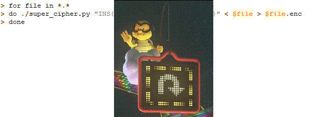

===================================
Breaking Synchronous Stream Ciphers
===================================

.. contents::

.. sectnum::

Introduction
============
A set of files encrypted using an unknown stream cipher was provided, along with an unencrypted file in plaintext::

   hint.gif.enc
   rule86.txt
   rule86.txt.enc
   super_cipher.py.enc

Goals
-----
- Obtain keystream using XOR on ``rule86.txt`` and ``rule86.txt.enc``
- Partially decrypt ``super_cipher.py.enc`` to view how the keystream was generated
- Fully decrypt ``super_cipher.py.enc`` and ``hint.gif.enc`` using the keystream function
- Reverse the keystream function
- Extract the original seed value used to generate the keystream

Methodology
===========

Obtaining the Keystream
-----------------------
Bitwise XOR was carried out on ``rule86.txt`` (511 bytes) and ``rule86.txt.enc`` (512 bytes) to obtain the keystream values used to encrypt the plaintext. Due to the associative property of XOR, the keystream values can be extracted::

   (keystream ⊕ rule86.txt) ⊕ rule86.txt.enc = keystream ⊕ (rule86.txt ⊕ rule86.txt.enc)

As ``rule86.txt`` is only 511 bytes, 511 bytes of the keystream was unmasked and saved as ``keystream``.

Partial Decryption
------------------
Since the keystream was reused to encrypt ``super_cipher.py.enc`` (768 bytes), it can be used to partially decrypt 511 bytes of the file, saved as ``super_cipher.py``. Examining this file yields some information on how the cipher keystream was generated.

::

   parser = argparse.ArgumentParser()
   parser.add_argument("key")
   args = parser.parse_args()

``super_cipher.py`` takes in a ``key`` argument, presumably used as the seed for generating the keystream.

::

   RULE = [86 >> i & 1 for i in range(8)]

``RULE`` contains a list of values from ``bin(86)`` (``0b01010110``) reversed: [0, 1, 1, 0, 1, 0, 1, 0]

::

   N_BYTES = 32
   N = 8 * N_BYTES

The author of ``super_cipher.py`` intends to work with 32 bytes and 256 bits.

::

   def next(x):
     x = (x & 1) << N+1 | x << 1 | x >> N-1
     y = 0
     for i in range(N):
       y |= RULE[(x >> i) & 7] << i
     return y

``next()`` is a hash function that takes an integer and performs bitwise operations to generate an integer that is 256 (``N``)-bits long.

::

   # Bootstrap the PNRG
   keystream = int.from_bytes(args.key.encode(),'little')
   for i in range(N//2):
     keystream = next(keystream)

The ``key`` value is converted to ``int``, then iteratively fed into the ``next()`` function 128 (``N//2``; floor division of 256 by 2) times (to bootstrap the *PNRG* (sic))

::

   # Encrypt / decrypt stdin to stdout
   plainte

This partial decryption tells us that the script takes input, and then feeds the encrypted or decrypted data to output.

Full Decryption
---------------
As the keystream had been reused to encrypt ``super_cipher.py`` and ``hint.gif``, it can be used again to decrypt both files. However, the extracted keystream of 511 bytes is not enough to fully decrypt ``super_cipher.py.enc`` (768 bytes) and ``hint.gif.enc`` (24,256 bytes). Hence, there is a need to make use of ``next()`` from the partially decrypted ``super_cipher.py`` to extend the keystream.

This was done by extracting the first 32 bytes of the keystream, then using it to XOR the first 32 bytes of the encrypted file. The 32-byte keystream was then fed into the ``next()`` function to obtain the next 32 bytes of the keystream. Subsequent 32 byte blocks of the encrypted file can then be iteratively decoded by generating keystream blocks as required until the end-of-file.

The fully decrypted ``super_cipher.py`` exposes the complete ``stdin/stout`` routine and confirms how the keystream is generated and used::

   # Encrypt / decrypt stdin to stdout
   plaintext = sys.stdin.buffer.read(N_BYTES)
   while plaintext:
     sys.stdout.buffer.write((
       int.from_bytes(plaintext,'little') ^ keystream
     ).to_bytes(N_BYTES,'little'))
     keystream = next(keystream)
     plaintext = sys.stdin.buffer.read(N_BYTES)

The fully decrypted ``hint.gif`` reveals part of the seed used in generating the keystream:

From next() to prev()
---------------------
Since the seed was fed through the ``next()`` function 128 times to initialize the keystream, the function has to be reversed so that the keystream can be stepped backwards until we reobtain the seed. The ``next()`` function was further examined.

::

   x = (x & 1) << N+1 | x << 1 | x >> N-1

``(x & 1) << N+1`` takes the least significant bit (``x & 1``) and left shifts it by 257 bits (``<< N+1``). This results in a value of 258 bits with the value of the least significant bit at the "head" (most significant bit) followed by 0s.

``x << 1`` left shifts the original input by 1 bit, resulting in a value of 257 bits with 0 at the "tail" (least significant bit).

``x >> N-1`` right shifts the original input by 255 bits, resulting in a value of 1 bit containing the original most significant bit.

``OR`` (``|``) is performed on all three bit values, combining them to a 258-bit long value. The overall effect of the line of code can be represented as::

    xABCDEFy → yxABCDEFyx
    (x & 1) << N+1: Prepends last bit to most significant bit (head)
    x << 1: Shifts original bits to middle to make space
    x >> N-1: Appends first bit to least significant bit (tail)

In order to reverse this step, trim the most and least significant bits off the bitstream. This can be accomplished a few ways.

   1. An AND (``&``) operation with a mask can be performed on the bitstream, followed by trimming the tail::
   
         x = (((1 << N+1)-1) & x) >> 1
   
   2. The tail of the bitstream can be trimmed before carrying out the AND with a mask::
   
         x = (x >> 1) & ((1 << N)-1)

   3. Take advantage of Python string manipulation to trim the binary string::
   
         x = int('0'+bin(x)[3:-1], 2)

::

    y = 0
    for i in range(N):
        y |= RULE[(x >> i) & 7] << i
    return y

``y = 0 .. for i in range(N): .. return y`` indicates that a new 256 (``N``)-bit keystream will be generated.

``(x >> i) & 7`` shifts the 258-bit value to the right by ``i``, before executing an AND (``&``) with 7 (``0b111``). This effectively returns a value between 0 to 7 inclusive by examining the 258-bit bitstream in 3-bit blocks starting from the tail. This 3-bit block moves towards the head by 1 bit per iteration.

``RULE[(x >> i) & 7]`` chooses a bit value from ``RULE`` using the value from the 3-bit blocks as an index.

``RULE[(x >> i) & 7] << i`` indicates that the chosen bit value is shifted left by ``i`` in each iteration of this routine.

``y |= RULE[(x >> i) & 7] << i``, read as ``y = y | (RULE[...] << i)``, indicates that the new 256-bit bitstream is built from the tail to the head.

The new bitstream is then returned as the next 32-byte keystream block.

By examining the mapping of bit triplets to the index of RULE, the following table can be drafted:

+----------------+-----------+-----------------+---+-----------------------+-----------+----------------+
| RULE Bit Value | Int Value | Current Triplet |   | Next Possible Triplet | Int Value | RULE Bit Value |
+================+===========+=================+===+=======================+===========+================+
| 0              | 0         | 000             | → | 000                   | 0         | 0              |
+                +           +                 +   +-----------------------+-----------+----------------+
|                |           |                 |   | 100                   | 4         | 1              |
+----------------+-----------+-----------------+---+-----------------------+-----------+----------------+
| 1              | 1         | 001             | → | 000                   | 0         | 0              |
+                +           +                 +   +-----------------------+-----------+----------------+
|                |           |                 |   | 100                   | 4         | 1              |
+----------------+-----------+-----------------+---+-----------------------+-----------+----------------+
| 1              | 2         | 010             | → | 001                   | 1         | 1              |
+                +           +                 +   +-----------------------+-----------+----------------+
|                |           |                 |   | 101                   | 5         | 0              |
+----------------+-----------+-----------------+---+-----------------------+-----------+----------------+
| 0              | 3         | 011             | → | 001                   | 1         | 1              |
+                +           +                 +   +-----------------------+-----------+----------------+
|                |           |                 |   | 101                   | 5         | 0              |
+----------------+-----------+-----------------+---+-----------------------+-----------+----------------+
| 1              | 4         | 100             | → | 010                   | 2         | 1              |
+                +           +                 +   +-----------------------+-----------+----------------+
|                |           |                 |   | 110                   | 6         | 1              |
+----------------+-----------+-----------------+---+-----------------------+-----------+----------------+
| 0              | 5         | 101             | → | 010                   | 2         | 1              |
+                +           +                 +   +-----------------------+-----------+----------------+
|                |           |                 |   | 110                   | 6         | 1              |
+----------------+-----------+-----------------+---+-----------------------+-----------+----------------+
| 1              | 6         | 110             | → | 011                   | 3         | 0              |
+                +           +                 +   +-----------------------+-----------+----------------+
|                |           |                 |   | 111                   | 7         | 0              |
+----------------+-----------+-----------------+---+-----------------------+-----------+----------------+
| 0              | 7         | 111             | → | 011                   | 3         | 0              |
+                +           +                 +   +-----------------------+-----------+----------------+
|                |           |                 |   | 111                   | 7         | 0              |
+----------------+-----------+-----------------+---+-----------------------+-----------+----------------+

To reverse this step, match the mapping of bits to triplets backwards:

+-----------------+---+----------+------------------+
| Current Triplet |   | Next Bit | Previous Triplet |
+=================+===+==========+==================+
| 000             | → | 0        | 000              |
+                 +   +----------+------------------+
|                 |   | 1        | 001              |
+-----------------+---+----------+------------------+
| 001             | → | 0        | 011              |
+                 +   +----------+------------------+
|                 |   | 1        | 010              |
+-----------------+---+----------+------------------+
| 010             | → | 0        | 101              |
+                 +   +----------+------------------+
|                 |   | 1        | 100              |
+-----------------+---+----------+------------------+
| 011             | → | 0        | 111              |
+                 +   +----------+------------------+
|                 |   | 1        | 110              |
+-----------------+---+----------+------------------+
| 100             | → | 0        | 000              |
+                 +   +----------+------------------+
|                 |   | 1        | 001              |
+-----------------+---+----------+------------------+
| 101             | → | 0        | 011              |
+                 +   +----------+------------------+
|                 |   | 1        | 010              |
+-----------------+---+----------+------------------+
| 110             | → | 0        | 101              |
+                 +   +----------+------------------+
|                 |   | 1        | 100              |
+-----------------+---+----------+------------------+
| 111             | → | 0        | 111              |
+                 +   +----------+------------------+
|                 |   | 1        | 110              |
+-----------------+---+----------+------------------+

For example, if ``y = 0b1011``, reading from left to right::

   0b1 → 0b0 → 0b1 → 0b1 is matched to
   001 → 011 → 110 → 100 or
   010 → 101 → 010 → 100 or
   100 → 000 → 001 → 010 or
   110 → 101 → 010 → 100 

Merging the bit triplets, we get the following possible values of ``x``::

   x = 001100 or 010100 (reject) or 100010 or 110100 (reject)

We only accept bitstreams with matching front and back 2 bits (``yxABCDEFyx``) due to the bitshifting operation carried out on ``x`` in ``next()``.

We recover the previous bitstream after trimming the head and tail bits on valid values of x (``yxABCDEFyx → xABCDEFy``)  ::

   x = 0110 or 0001 (collision!)

The function to reverse ``next()`` is written into ``prev()``.

Extracting the Seed
-------------------
To extract the seed from the keystream, the initial 32-byte keystream block is fed into the ``prev()`` function and iterated 128 (``N//2``) times, the same number of times the seed was iterated to get the initial keystream block. The final ``int`` value is then converted to bytes before being decoded into a ``utf-8`` string::

   INS{Rule86_is_W0lfr4m_Cha0s}

Conclusion
==========
The keystream was able to be recovered using ``XOR`` since an encrypted/plaintext pair of files was provided.
Subsequently, the encrypted files and the seed value were able to be fully recovered because the keystream was reused. This exercise demonstrates the importance of not reusing keystream values in synchronous stream cipher encryptions, as the cipher will become vulnerable to exploits, rendering the encryption broken.

Source Code
===========
solution.py_

.. _solution.py: https://github.com/ooknosi/tools_lab_2/blob/master/04_breaking_synchronous_stream_ciphers/homework/src/solution.py
