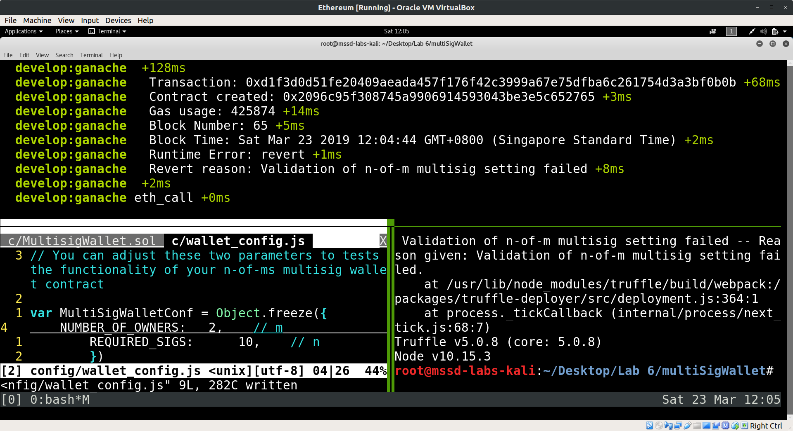
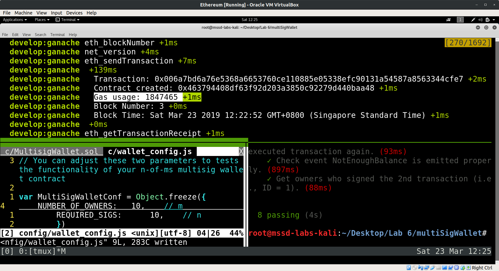

=============================================
Blockchain and Smart Contracts Using Ethereum
=============================================

.. contents::

.. sectnum::

Introduction
============
An incompletely implemented Ethereum smart contract that implements a multi-signature wallet was provided.

Goals
-----
- Add functionality to the smart contract to protect against replay attacks
- Change the wallet to support an arbitrary number of owners (m) with a minimum required number of signers (n)
- Include a check for sufficient contract balance before executing transfer of Ether
- Create a function that retrieves the addresses of owners that signed a transaction
- Discuss the contents of transaction receipt logs

Methodology
===========

Protection Against Replay Attacks
---------------------------------
An additional ``executed`` boolean field was added to ``struct Transaction``. The initial value of this field is ``false`` when the transaction is first added, and is flipped to ``true`` after the transaction is executed. A ``txnNotExecuted`` modifier is created and placed at the start of the ``executeTransaction()`` function. The modifier will ``revert`` if the transaction has already been executed, preventing the replay from occuring.

n-of-m Multi-Signature Wallet
-----------------------------
The wallet was changed from a 2-of-2 scheme to an n-of-m scheme. Loops were used to check that each owner of the contract was not a null address, and that no repeated owners were included. Once the checks pass, another loop was used to save the owners of the contract.

The ``modifier checkValidSettings`` was also changed to test for valid setting ranges. ``ownerCount`` should not be zero (0) or exceed ``MAX_OWNER_COUNT``. ``_requiredSigs`` should not be zero (0) or exceed ``ownerCount`` (instead of ``MAX_OWNER_COUNT`` as stated in the task requirement, in order to catch invalid settings where the required number of signatures exceeds the numer of owners of the contract.)

  Modified task requirement to catch _requiredSigs > ownerCount instead of _requiredSigs > MAX_OWNER_COUNT.

Checking Sufficiency of Contract Balance
----------------------------------------
Additional checks for sufficient contract balance was added on transaction confirmation. A new event ``NotEnoughBalance`` was declared. If the requested balance (``txn.value``) exceeds the current contract balance (``address(this).balance``), the event was emitted, interrupting the execution of the transaction.

Retrieving Owners of Transaction Signatures
-------------------------------------------
``function getOwnersWhoSignedTx()`` was created to retrieve the addresses of the owners of transaction signatures. Initially, ``push()`` was attempted on a new ``address[] memory`` array to store the addresses. This triggered a ``TypeError`` as the ``address[]`` array is of fixed length when declared in ``memory`` instead of ``storage``. Instead, the owner addresses had to be assigned individually to indexes of the array of length ``getSignatureCount()``.

Discussion
==========

Resources Used in Deployment
----------------------------

The contract was created in block number 3 (assuming initial run of ``truffle develop --log``).

The gas cost for contract deployment varies depending on the number of owners and required signatures. For a multi-signature smart contract with two owners, the gas cost is 1,498,037. For a smart contract with 10 owners, the gas cost rises to 1,847,465.

At the time of this report (2019 Mar 23 0510 UT), assuming a gas price of 2 Gwei (2e-9 ether) for a standard wait time of less than 5 minutes, 1,847,465 gas converted to USD$0.506. [#]_

.. [#] https://ethgasstation.info/

Full Receipts of Confirmation and Submission Calls
--------------------------------------------------
Since the output of ``contract.submitTransaction`` was stored in ``var receipt``, ``console.log`` was called on ``receipt``::

   var receipt = await contract.submitTransaction(RECEPIENT, VALUE_SENT, {from: accounts[0]});    
   console.log(receipt);

This resulted in the output detailed within `receipt.log <https://github.com/ooknosi/tools_lab_2/tree/master/06_blockchain_and_smart_contracts_using_ethereum/homework/src/receipt.log>`_.

The extracted log contains details on the `Submission` event, as well as the `Confirmation` event.

The fields on the full receipt log as follows:

   :tx: Contains the hash string for the transaction.

   :receipt.transactionHash: Contains the hash string for the transaction.

   :receipt.transactionIndex: Indicates the position of the transaction in the block.

   :receipt.blockHash: Hash string of the block containing the transaction.

   :receipt.blockNumber: Block number containing the transaction.

   :receipt.from: Address of the sender.

   :receipt.to: Address of the receiver.

   :receipt.gasUsed: Amount of gas used by this transaction.

   :receipt.cumulativeGasUsed: Total amount of gas used when this transaction was executed in the block.

   :receipt.contractAddress: Address of contract if the transaction is a contract creation.

   :receipt.logs: Array of log objects generated by this transaction.

   :receipt.status: Boolean to indicate transaction failure or success.

   :receipt.logsBloom: Bloom filter for the logs of this block.

   :receipt.v: Recovery ID (recid) for public key recovery. Used to speed up signature verification.

   :receipt.r: Part of the Elliptic Curve Digital Signature Algorithm (ECDSA) signature pair, used in public key recovery.

   :receipt.s: The other part of the ECDSA signature pair, used in public key recovery.

   :receipt.rawLogs: Undecoded logs; stopgap measure until Application Binary Interface (ABI) for all events can be obtained

   :logs.logIndex: Log position in the block.

   :logs.transactionIndex: Indicates the position of the transaction in the block that this log was created from.

   :logs.transactionHash: Contains the hash string for the transaction that this log was created from.

   :logs.blockHash: Hash string of the block containing this log.

   :logs.blockNumber: Block number containing this log.

   :logs.address: Address where this log originated.

   :logs.type: `'pending'` or `'mined'`.

   :logs.id: Log identifier.

   :logs.event: The name of the event that triggered this log.

   :logs.args: The arguments from this event.

Conclusion
==========
The 2-of-2 multi-signature smart contract wallet was convert to support n-of-m signatures. The functionality for protection against replay attacks was added, as well as a check for sufficient balance before transfer. A new function was added that retrieves addresses of owners who signed a transaction. The full transaction receipt logs was examined.

Source Code
===========
MultisigWallet.sol_

.. _MultisigWallet.sol: https://github.com/ooknosi/tools_lab_2/blob/master/06_blockchain_and_smart_contracts_using_ethereum/homework/src/MultisigWallet.sol
