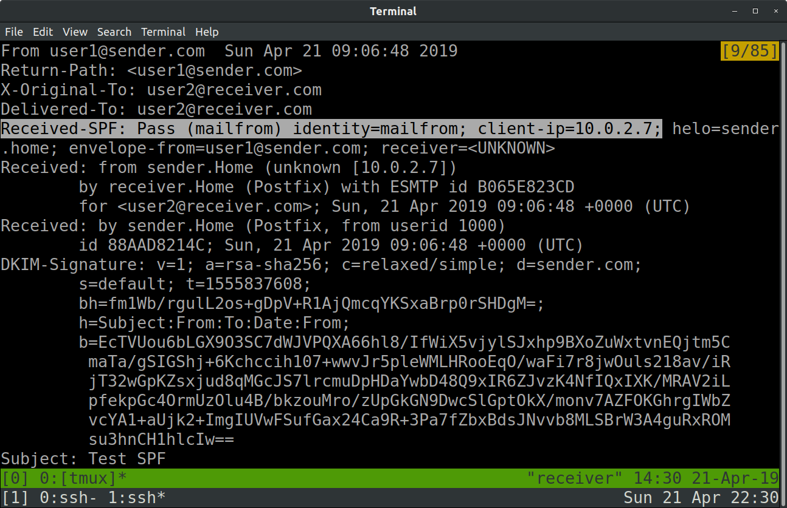

==============
Email Security
==============

.. contents::

.. sectnum::

Introduction
============

   Implement and configure ``SPF`` (Sender Policy Framework) and ``DKIM`` (DomainKeys Identified Mail) on a ``sender`` mail server and a ``receiver`` mail server.

Methodology
===========

Installation
------------

Server and IP Configuration
~~~~~~~~~~~~~~~~~~~~~~~~~~~

Ubuntu Server 18.04.2 LTS [#]_ was downloaded and installed in VirtualBox.

.. [#] https://www.ubuntu.com/download/server/thank-you?version=18.04.2&architecture=amd64

The first virtual machine (VM) was set up with the following information:
   
   :Hostname: ``sender``
   :Username: user1
   :Password: password1

The second VM was set up with the following information:

   :Hostname: ``receiver``
   :Username: user2
   :Password: password2

OpenSSH server was installed on both VMs during set up for convenience.

When installation is complete, networking settings for both VMs were set to the following:

   :Adapter 1: NAT
   :Adapter 2: NAT Network

On the first network interface (NAT), add port forwarding rules:

   :Name: Rule 1
   :Protocol: TCP
   :Host IP: 127.0.0.1
   :Host Port: 2227 (2228 for ``receiver``)
   :Guest IP: 10.0.2.15
   :Guest Port: 22

This allows the host to SSH into the VMs which can be started headless, instead of having to interact through VirtualBox windows::

   ssh -vp2227 user1@127.0.0.1

   ssh -vp2228 user2@127.0.0.1

Static IP addresses were configured for both ``sender`` and ``receiver`` mail servers. ``sender`` was assigned an IP address of ``10.0.2.7`` (seven for send), while ``receiver`` was assigned an IP address of ``10.0.2.8`` (change the appropriate line).

``/etc/netplan/01-netcfg.yaml``::

   network:
       ethernets:
           enp0s3:
               dhcp: true
           enp0s8:
               dhcp4: false
               addresses: [10.0.2.7/24]
               gateway4: 10.0.2.1
               nameservers:
                   addresses: [127.0.0.1]
               dhcp6: false
       version: 2

Test and apply the ``netplan`` settings::

   sudo netplan try

**NOTE FOR UBUNTU 18.04 HOSTS**

A VirtualBox bug on hosts running Ubuntu 18.04 LTS prevents ``NAT Network`` from making proper connections to the Internet [#]_. When ``NAT`` is enabled, ``NAT Network`` stops connecting to other guests.

If facing this problem, enable only ``NAT`` on ``Adapter 1`` while setting up the VMs, before switching it off and enabling ``NAT Network`` on ``Adapter 2`` when ready to proceed with testing.

Even then, ``DKIM`` queries will not work properly, and will time out instead. Use either Ubuntu 18.10 or a Windows 10 host to get proper query results.

.. [#] https://bugs.launchpad.net/ubuntu/+source/virtualbox/+bug/1798813

bind9 DNS Setup
~~~~~~~~~~~~~~~

Install ``bind9``::

   sudo apt update && sudo apt install bind9

Change the DNS resolver daemon to use ``localhost`` instead of querying the router.

``/etc/systemd/resolved.conf``::

   [Resolve]
   DNS=127.0.0.1

Restart ``systemd-resolved`` to apply the settings::

   sudo service systemd-resolved restart

Add forward zones to the local DNS settings.

``sudo vi /etc/bind/named.conf.local``::

   zone "sender.com" {
           type master;
           file "db.sender.com";
   };

   zone "receiver.com" {
           type master;
           file "db.receiver.com";
   };

Create the respective zone files.

``/var/cache/bind/db.sender.com``: `db.sender.com <https://raw.githubusercontent.com/ooknosi/tools_lab_2/master/09_email_security/homework/src/db.sender.com>`_

``/var/cache/bind/db.receiver.com``: `db.receiver.com <https://raw.githubusercontent.com/ooknosi/tools_lab_2/master/09_email_security/homework/src/db.receiver.com>`_

The validity of the zone files can be checked::

   sudo named-checkzone sender.com /var/cache/bind/db.sender.com

   sudo named-checkzone receiver.com /var/cache/bind/db.receiver.com

Restart ``bind9`` to apply settings::

   sudo service restart bind9

postfix Mail Transfer Agent Setup
~~~~~~~~~~~~~~~~~~~~~~~~~~~~~~~~~

Install ``postfix``::

   sudo apt install postfix

Select ``Internet Site`` for the type of mail configuration.

The mail name should be set respectively::

   sender.com

   receiver.com

SPF and DKIM Setup
~~~~~~~~~~~~~~~~~~

Install ``SPF daemon``, ``OpenDKIM`` and associated tools::

   sudo apt install postfix-policyd-spf-python opendkim opendkim-tools python-dkim mailutils

Add the ``postfix`` user to the ``opendkim`` user group::

   sudo usermod -aG opendkim postfix

Edit ``postfix`` master process configuration to start the ``SPF daemon``.

``/etc/postfix/master.cf``::

   # Postfix master process configuration file. ...
   ...

   policyd-spf unix -       n       n       -       0       spawn
     user=policyd-spf argv=/usr/bin/policyd-spf

Configure ``postfix`` to reject mail that fails SPF, and add settings for ``OpenDKIM``.

``/etc/postfix/main.cf``::

   # See /usr/share/postfix/main.cf.dist for a commented...
   ...

   policyd-spf_time_limit = 3600
   smtpd_recipient_restrictions = permit_mynetworks permit_sasl_authenticated reject_unauth_destination check_policy_service unix:private/policyd-spf
   # milter configuration for opendkim
   milter_default_action = accept
   milter_protocol = 6
   smtpd_milters = local:/opendkim/opendkim.sock
   non_smtpd_milters = $smtpd_milters

Edit the settings for ``OpenDKIM``.

``/etc/opendkim.conf``::

   ...
   # Commonly-used options; the commented-out versions show the defaults.
   #Canonicalization       simple
   #Mode                   sv
   #SubDomains             no
   Canonicalization        relaxed/simple
   Mode                    sv
   SubDomains              no
   AutoRestart             yes
   AutoRestartRate         10/1M
   Background              yes
   DNSTimeout              5
   SignatureAlgorithm      rsa-sha256

Comment out the following socket configuration and add the following::

   #Socket                 local:/var/run/opendkim/opendkim.sock
   Socket                  local:/var/spool/postfix/opendkim/opendkim.sock

Append the following configuration at end of file::

   ...
   # KeyTable and SigningTable required on sender.com only #
   KeyTable                /etc/opendkim/key.table
   SigningTable            refile:/etc/opendkim/signing.table
   # ----------------------------------------------------- #
   ExternalIgnoreList      /etc/opendkim/trusted.hosts
   InternalHosts           /etc/opendkim/trusted.hosts
   # to help with debugging
   LogWhy                  Yes
   SyslogSuccess           Yes
   # important so that opendkim queries local dns
   Nameservers             127.0.0.1

**NOTE**: Not adding the ``Nameservers`` setting will cause ``OpenDKIM`` to query actual DNS. The query will fail when it cannot find the DKIM public key.

Create ``OpenDKIM`` directories for ``sender`` and ``receiver`` respectively::

   sudo mkdir -pv /etc/opendkim/keys/sender.com
   sudo chown -R opendkim:opendkim /etc/opendkim
   sudo chmod 711 /etc/opendkim/keys
   sudo mkdir -pv /var/spool/postfix/opendkim
   sudo chown opendkim:postfix !$

Create the file for trusted hosts for ``sender`` and ``receiver`` respectively.

``/etc/opendkim/trusted.hosts``::

   127.0.0.1
   localhost
   *.sender.com

On ``sender``, create the signing table and the key table:

``/etc/opendkim/signing.table``::

   *@sender.com default._domainkey.sender

``/etc/opendkim/key.table``::

   default._domainkey.sender sender.com:default:/etc/opendkim/keys/sender.com/default.private

OpenDKIM Public/Private Key Pair Generation
~~~~~~~~~~~~~~~~~~~~~~~~~~~~~~~~~~~~~~~~~~~

Generate the public/private key pair for ``sender``, with a 2048-bit length as recommended by the Certified Senders Alliance in 2018 [#]_::

   sudo opendkim-genkey -b 2048 -d sender.com -D /etc/opendkim/keys/sender.com -s default -v

.. [#] https://certified-senders.org/wp-content/uploads/2018/06/DKIM-Recommendations-2018.pdf

Change the owner of the private key to ``opendkim``::

   sudo chown opendkim:opendkim /etc/opendkim/keys/sender.com/default.private

Restart all services for the settings to apply::

   sudo service bind9 restart && sudo service postfix restart && sudo service opendkim restart

Results
=======

Sending Plain Email
-------------------
A plain email was sent from ``sender`` to ``receiver``::

   echo "Hello from User 1" | mail -s "Subject 1" -a "From:user1@sender.com" user2@receiver.com

Email can be viewed on the ``receiver`` at ``/var/mail/user2``.

When receiving email without ``SPF`` or ``DKIM``, ``Received-SPF`` will have a value of ``None``.

  Received-SPF: None

The content of the email was saved to `plain.eml <https://raw.githubusercontent.com/ooknosi/tools_lab_2/master/09_email_security/homework/src/plain.eml>`_.

Sending Spoofed Email
---------------------
The IP address of ``sender`` was changed by editing the ``netplan`` configuration file.

``/etc/netplan/01-netcfg.yaml``::

   network:
      ...
           enp0s8:
               ...
               addresses: [10.0.2.9/24]
               ...

Settings were applied::

   sudo netplan apply

An email from a "spoofed" IP address was sent from ``sender`` to ``receiver``::

   echo "Spoofed sender" | mail -s "Spoof" -a "From:user1@sender.com" user2@receiver.com

The email will still be received by ``receiver``, but from the different IP address as expected.

  client-ip=10.0.2.9

The content of the email was saved to `spoofed.eml <https://raw.githubusercontent.com/ooknosi/tools_lab_2/master/09_email_security/homework/src/spoofed.eml>`_.

Enabling SPF
------------
``SPF`` was enabled by adding a ``TXT`` record to the local DNS zone file at ``receiver``.

``/var/cache/bind/db.sender.com``::

   ...
   @       IN      TXT     "v=spf1 ip4:10.0.2.7 -all"

The zone file is formatted in the following manner:

   :name: ``@`` is a shortcut for the value of ``$ORIGIN`` (i.e. ``example.com.``).

   :ttl: Leaving ``ttl`` blank defaults the time-to-live field to the value of ``$TTL`` (i.e. ``1d``).

   :record class: ``IN`` refers to the Internet namespace.

   :record type: ``TXT`` records are used to store SPF configuration

   :record data:
      ``v=spf1`` indicates version 1 of the Sender Policy Framework is used.

      ``ip4:x.x.x.x`` directly lists the outgoing mail server's IP address to avoid additional DNS lookups, which is limited to a maximum of 10.

      ``-all`` rejects all mail that do not match SPF records.

After restarting the DNS service (``sudo service bind9 restart``), the ``TXT`` record can be retrieved::

   dig sender.com txt

  "v=spf1 ip4:10.0.2.7 -all" in TXT record for sender.com

Sending Email with SPF
----------------------
The IP address of ``sender`` was reset to ``10.0.2.7`` in ``netplan`` before proceeding.

An email was sent from ``sender`` to ``receiver``::

   echo "Hello from User 1 with SPF" | mail -s "Test SPF" -a "From:user1@sender.com" user2@receiver.com

The email was received with a ``Received-SPF: Pass`` header.

  Received-SPF: Pass

The content of the email was saved to `spf_pass.eml <https://raw.githubusercontent.com/ooknosi/tools_lab_2/master/09_email_security/homework/src/spf_pass.eml>`_.

Sending Email with Invalid SPF
------------------------------
The IP address of ``sender`` was once again changed to ``10.0.2.9`` via ``netplan``.

An email was sent from ``sender`` to ``receiver``::

   echo "Spoofed sender with SPF" | mail -s "Spoof with SPF" -a "From:user1@sender.com" user2@receiver.com

``receiver`` did not receive any email as the SPF policy is set to hard fail invalid checks.

The spoofer (``sender``) however, received an email notification for failing the SPF check.

  Message rejected due to: SPF fail - not authorized.

The content of the email was saved to `spf_fail.eml <https://raw.githubusercontent.com/ooknosi/tools_lab_2/master/09_email_security/homework/src/spf_fail.eml>`_.

Enabling DKIM
-------------
The public key in ``sender``'s ``/etc/opendkim/keys/sender.com/default.txt`` was added to the DNS zone records, particularly in ``receiver``, for ``DKIM`` checks to succeed. Since the 2048-bit key we generated consists of over 256 characters, the entry for the TXT record has to be split into chunks of 255 octets or less due to the limit specified in RFC 1035 [#]_. Whitespace and splits are minimized to reduce overheads.
  
``/var/cache/bind/db.sender.com`` at ``receiver``::

   ...
   default._domainkey IN TXT ("v=DKIM1;h=sha256;k=rsa;p=MIIBIjANBgkqhkiG9w0BAQEFAAOCAQ8AMIIBCgKCAQEAvWQL2VqOiT/7bI7nDIJG/IAjRb9bx603b249CpxoolCIKLh6zWabZQYdCbo8kci4rPr1AoC7vTUnFHT1PcSLKA6UpRqe2+2hn9jiDf/3mlXMeKSxUZXAM9jlI71dDp0rlgYwavix1LPrd6VoxR2uhkDw2FKDZDxNH9BVDohQtbDb4zlSsBwz6" "ufZ1kPelFkohtiYLulTFKC662CKIaYVSnklXHhl+ie9n68qHlcXvd6ssbm7Am2k85p3aJGQVJ79gK9bFJdBiHZjrU5V+3+gB7hRIKNG69sAv4ggEGKj1SNtPRULhNeXrH963MRQzP5Gw+8t/iejXoJYxE9dqodXGQIDAQAB")

.. [#] https://tools.ietf.org/html/rfc1035#section-3.3.14

Restart all services for the settings to apply::

   sudo service bind9 restart && sudo service postfix restart && sudo service opendkim restart

Test the ``OpenDKIM`` key, which should return ``key OK``::

   opendkim-testkey -d sender.com -s default -vvv

The domain key ``TXT`` record can then be retrieved::

   dig default._domainkey.sender.com txt

  dig default._domainkey.sender.com txt

Sending Email with DKIM
-----------------------
The IP address of ``sender`` was reset to ``10.0.2.7`` in ``netplan`` before proceeding.

An email was sent from ``sender`` to ``receiver``::

   echo "Hello from User 1 with SPF and DKIM" | mail -s "Test SPF and DKIM" -a "From:user1@sender.com" user2@receiver.com

The email was received with a ``dkim=pass`` header.

  dkim=pass (2048-bit key; unprotected)

The content of the email was saved to `dkim_pass.eml <https://raw.githubusercontent.com/ooknosi/tools_lab_2/master/09_email_security/homework/src/dkim_pass.eml>`_.

The email was checked against the local DNS::

   dkimverify < dkim_pass.eml

  Verified DKIM signature

DKIM Verification Failure
-------------------------
To trigger a ``DKIM`` verification failure, the public key in ``receiver``'s ``/var/cache/bind/db.sender.com`` was modified. Services were restarted as above.

An email was sent from ``sender`` to ``receiver``::

   echo "Hello from User 1 with failing DKIM" | mail -s "Test failing DKIM" -a "From:user1@sender.com" user2@receiver.com

The email was received with a ``dkim=permerror`` header, which indicates that the message could not be verified as the email signature did not match the public key retrieved from ``default._domainkey.sender.com``.

  dkim=permerror (0-bit key; unprotected)

The content of the email was saved to `dkim_fail.eml <https://raw.githubusercontent.com/ooknosi/tools_lab_2/master/09_email_security/homework/src/dkim_fail.eml>`_.

The email was checked against the local DNS::

   dkimverify < dkim_fail.eml

  Invalid DKIM signature

Discussion
==========

Digging TXT Records
-------------------
   Based on ``DIG TXT`` for SUTD, how many IP addresses are permitted to send email on behalf of ``sutd.edu.sg``?

Retrieving and following all ``SPF`` rules on ``sutd.edu.sg``::

   sutd.edu.sg.            3599    IN      TXT     "v=spf1 ip4:103.24.77.20 ip4:202.94.70.20 include:spf.protection.outlook.com -all" 

   spf.protection.outlook.com. 181 IN      TXT     "v=spf1 ip4:207.46.100.0/24 ip4:207.46.163.0/24 ip4:65.55.169.0/24 ip4:157.56.110.0/23 ip4:157.55.234.0/24 ip4:213.199.154.0/24 ip4:213.199.180.128/26 ip4:52.100.0.0/14 include:spfa.protection.outlook.com -all"

   spfa.protection.outlook.com. 482 IN     TXT     "v=spf1 ip4:157.56.112.0/24 ip4:207.46.51.64/26 ip4:64.4.22.64/26 ip4:40.92.0.0/15 ip4:40.107.0.0/16 ip4:134.170.140.0/24 include:spfb.protection.outlook.com ip6:2001:489a:2202::/48 -all"

   spfb.protection.outlook.com. 260 IN     TXT     "v=spf1 ip6:2a01:111:f400::/48 ip4:23.103.128.0/19 ip4:23.103.198.0/23 ip4:65.55.88.0/24 ip4:104.47.0.0/17 ip4:23.103.200.0/21 ip4:23.103.208.0/21 ip4:23.103.191.0/24 ip4:216.32.180.0/23 ip4:94.245.120.64/26 -all"

The number of allowed IPv4 addresses permitted to send email for ``sutd.edu.sg`` is 507,906.

The number of allowed IPv6 addresses permitted to send email for ``sutd.edu.sg`` is over 2.4E24.

The breakdown as follows:

+---------------------+-----------------------+
| IPv4/6 Address      | Address Count         |
+=====================+=======================+
| 103.24.77.20        | 1                     |
+---------------------+-----------------------+
| 202.94.70.20        | 1                     |
+---------------------+-----------------------+
| 207.46.100.0/24     | 256                   |
+---------------------+-----------------------+
| 207.46.163.0/24     | 256                   |
+---------------------+-----------------------+
| 65.55.169.0/24      | 256                   |
+---------------------+-----------------------+
| 157.56.110.0/23     | 512                   |
+---------------------+-----------------------+
| 157.55.234.0/24     | 256                   |
+---------------------+-----------------------+
| 213.199.154.0/24    | 256                   |
+---------------------+-----------------------+
| 213.199.180.128/26  | 64                    |
+---------------------+-----------------------+
| 52.100.0.0/14       | 262144                |
+---------------------+-----------------------+
| 157.56.112.0/24     | 256                   |
+---------------------+-----------------------+
| 207.46.51.64/26     | 64                    |
+---------------------+-----------------------+
| 64.4.22.64/26       | 64                    |
+---------------------+-----------------------+
| 40.92.0.0/15        | 131072                |
+---------------------+-----------------------+
| 40.107.0.0/16       | 65536                 |
+---------------------+-----------------------+
| 134.170.140.0/24    | 256                   |
+---------------------+-----------------------+
| 23.103.128.0/19     | 8192                  |
+---------------------+-----------------------+
| 23.103.198.0/23     | 512                   |
+---------------------+-----------------------+
| 65.55.88.0/24       | 256                   |
+---------------------+-----------------------+
| 104.47.0.0/17       | 32768                 |
+---------------------+-----------------------+
| 23.103.200.0/21     | 2048                  |
+---------------------+-----------------------+
| 23.103.208.0/21     | 2048                  |
+---------------------+-----------------------+
| 23.103.191.0/24     | 256                   |
+---------------------+-----------------------+
| 216.32.180.0/23     | 512                   |
+---------------------+-----------------------+
| 94.245.120.64/26    | 64                    |
+---------------------+-----------------------+
| Sub-total           | 507906                |
+---------------------+-----------------------+
| 2001:489a:2202::/48 | 1.20892581961463E+024 |
+---------------------+-----------------------+
| 2a01:111:f400::/48  | 1.20892581961463E+024 |
+---------------------+-----------------------+
| Sub-total           | 2.41785163922926E+024 |
+---------------------+-----------------------+
| TOTAL               | 2.41785163922926E+024 |
+---------------------+-----------------------+

DKIM TXT Entry Tags
-------------------
   Can you explain the significance of all the tags in your DKIM entry (v, a, c, d, s, t, bh, h, b)?

The definitions of the DKIM signature header field tags can be referenced from Section 3.5 of RFC 6376 [#]_, and are as follows:

:v: DKIM version; current implementation is "1"

:a: Signature algorithm; current recommendation is "rsa-sha256"

:c: Message canonicalization for header/body; "simple" is strict, "relaxed" is less strict

:d: Signing Domain Identifier (SDID) responsible for introducing the message; used in querying DNS for public key

:s: Selector; used in querying DNS for public key

:t: Timestamp of signature; measured in Unix Epoch time

:bh: Hash of canonicalized body as limited by body length count

:h: Signed header fields; contains complete list of header fields to be signed

:b: Signature data in base64; signed hash of the message hash

.. [#] https://tools.ietf.org/html/rfc6376#section-3.5
