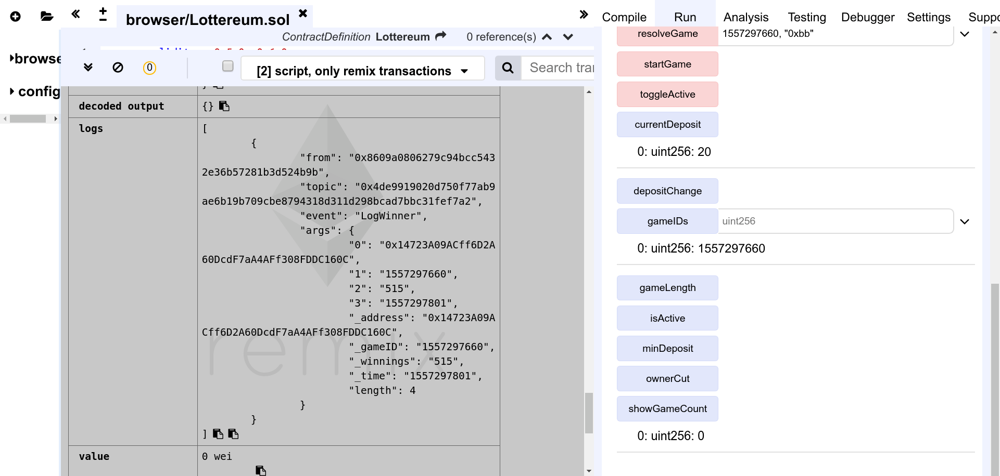

=========
Lottereum
=========

.. contents::

.. sectnum::

Introduction
============
A contract for a decentralized fair lottery was constructed to fulfill the requirements that ensure winner selection is not biased by any single party:

   - each participant contributes a secret input along with their bet in phase 1
   - no further input can be made after secret inputs are revealed in phase 2
   - secret inputs are combined to select a random winner
   - winners are selected according to their bet ratio
   - a honesty deposit is required per buy-in
   - the pot for the honesty deposit is distributed to participants who reveal their secret inputs in phase 2
   - the honesty deposit increases in the case of dishonest play, and decreases in the case of honest play
   - each phase should have some way to track gameplay length
   - anybody can call for the reward function to select a winner and complete the payout in phase 3
   - anybody should be able to create concurrent lottery rounds

Methodology
===========

Phase 1 - Secret Input and Betting
----------------------------------
Each buy-in is stored as a ``struct Ticket`` that is mapped to the player's address within each ``struct Game``. The user's 32-byte input is hashed and stored in the ticket.

Phase 2 - Resolution of Secret Inputs
-------------------------------------
When the time allocated for phase 1 is over, ``resolveGame()`` is allowed to be called by players. Players will have the same amount of time as allocated to phase 1 to submit their initial secret inputs. The hashes of the submissions are compared to their ticket to determine their honesty. Honest players are then added to the honestPlayers list.

User inputs of honest players are combined by ``mergeHash()``. This interleaves ``bytes32`` positions of ``game.combinedInput``, which is a running hash of inputs, with the ``bytes32`` submitted input, resulting in a length of 64 bytes. The combined input is re-hashed using ``keccak256`` again resulting in a 32-byte long hash.

Phase 3 - Deposit Disbursement and Winner Selection
---------------------------------------------------
When the time allocated for phase 2 is over, ``getPayout()`` is allowed to be called by players. If no winner has been selected yet, ``depositPot`` is disbursed equally to the list of ``honestPlayers``, and ``currentDeposit`` is adjusted for new rounds.

``game.combinedInput`` is casted to ``uint256`` and the modulus against ``game.jackpot`` + 1 is used to obtain a ``combinedRandom`` number that falls within the range of ``game.jackpot``. The running total of bets made by each honest player is then summed up until it exceeds the ``combinedRandom`` number, which determines the lottery winner.

Concurrent Lottery Rounds 
--------------------------
Games are identified by their current block's timestamp in epoch time (``now``). Multiple active ``gameIDs`` are tracked using an array. The array of games is trimmed whenever a game expires.

Tracking Gameplay Length
------------------------
Each phase of a game is tracked by adding time in seconds to the ``gameID``. The game's ``endTime`` and ``resolveTime`` compared to ``now`` determines when a function call for the respective phase is allowed to execute.

Results
=======

Successful Compilation
----------------------

  Compiled with solidity 0.5.0

``solidity >= 0.5.0`` was chosen to adapt to breaking changes and to keep the contract code future-proof for as long as possible.

Deploying the Contract
----------------------

  Contract deployment

The contract can be deployed with user-defined variables. In the above figure, the contract was deployed with the owner taking 1% of the winnings, a minimum honesty deposit of 10 wei, a current deposit of 20 wei, a fluctuation of 5 wei, and a game time of 60 seconds.

Starting Multiple Games
-----------------------

  Multiple games can be started

Concurrent games can be started by anybody. The games are tracked by their ``GameIDs``, which can be retried by checking their index limited by ``showGameCount``.

Buying Tickets
--------------

  Buying ticket from different accounts

Two tickets were purchased by two accounts. ``0xca3...a733c`` purchased a ticket worth 50 wei, while ``0x147...c160c`` purchased a ticket worth 5000 wei. 20 wei will be taken from each player for their deposit. Each player also has to provide a ``bytes32`` input during their purchase, which is hashed and stored in their ``Ticket``.

Resolving Secret Inputs
-----------------------

  Resolving inputs from different accounts

Both accounts that purchased a ticket send in their inputs again during the game resolution phase in order to participate in the draw.

Getting Payouts
---------------

  Requesting for the winner and getting payouts

The screenshot shows the first account ``0xca3...a733c`` requesting for payout during the payout phase. Unsurprisingly, ``0x147...c160c`` who bet a comparatively large amount was chosen as the winner, with a payout of 4960 wei. This amount is a result of the following:

   ========= ==== ======= ==== =====
   Players   Bets Deposit Cut  Total
   ========= ==== ======= ==== =====
   ``0xca3`` 50   20      0.3  30
   ``0x147`` 5000 20      49.8 4930
   ========= ==== ======= ==== =====

The game cleans itself up at the end of ``getPayout()``, removing itself from the array of ``GameIDs`` in order to get some gas refund.

Honesty Deposit
---------------

  Reduced honesty deposit

The honesty deposit reduces to 15 wei as players were honest.

Dishonest Play
--------------

  Second round of buy-ins

A second round of lottery was conducted to demonstrate dishonest play. Note the buy-in does not occur if the bet amount falls below the deposit (currently at 15 wei).

  Increased honesty deposit

This time, ``0xca3...a733c`` does not resubmit the secret input. ``0x147...c160c`` then wins. Note the ``currentDeposit`` has risen back to 20 wei after the game resolution due to dishonest play.

Source Code
===========
The source code for Lottereum can be found on `Github`_.

.. _Github: https://github.com/ooknosi/tools_lab_2/tree/master/10_lottereum/homework/src
